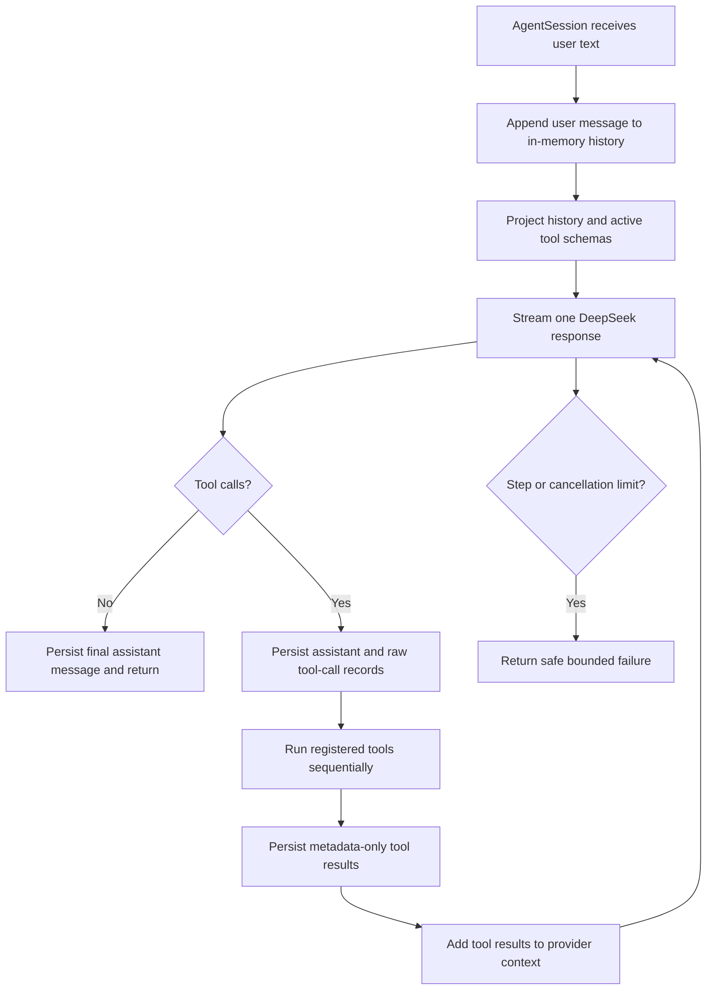

# Weaver Agent Audit

**Audit date:** 2026-07-30  
**Repository:** `/home/hax/novelfriend`  
**Git snapshot:** `96d0729` (`Accept Plan 001 foundation`)  
**Audit type:** Current-state architecture and agent-runtime audit

## Bottom line

Weaver is not yet a usable end-to-end conversational agent.

It does have the early parts of a sensible custom-agent architecture:

- a provider-neutral model boundary;
- a DeepSeek adapter and deterministic fake model;
- a small streaming model/tool loop;
- an in-memory conversation session;
- an explicit typed tool registry;
- a strong deterministic Shadow Slave corpus toolset;
- placeholder interfaces for future memory systems.

The most developed part is the deterministic corpus pipeline. The least
developed part is the actual product-level agent: there is no chat entry point,
no durable conversation store, no real memory, no web-search tool, no UI event
protocol, and no accepted wiring that gives the conversation loop access to the
corpus tools.

The right direction is visible: Weaver should remain a custom agent whose LLM
chooses bounded tools, while deterministic code owns validation, permissions,
writes, receipts, and repeatability. LangGraph, if admitted later, should only
help with an explicitly chosen orchestration boundary. It should not replace
the corpus pipeline or become the whole system.

## Status of the repository

The accepted Git snapshot contains the Plan 001 model/repository foundation.
The current working tree also contains a much larger uncommitted candidate:
Plan 002 corpus code, an agent-loop prototype, memory placeholders, tests, and
architecture notes.

That distinction matters:

- **Accepted foundation:** tracked at Git snapshot `96d0729`.
- **Implemented candidate:** present in the current working tree.
- **Plan 002 acceptance:** still blocked on the live evidence and owner decision
  recorded in `plans/002-trusted-shadow-slave-library.md:3-11`.
- **Agent runtime acceptance:** no numbered accepted experiment currently proves
  the conversation/tool loop against the live DeepSeek provider.

The worktree was already dirty before this audit. This audit did not alter
source code or private novel files.

## What is available now

| Area | Current state | Evidence |
|---|---|---|
| Model boundary | A small `ModelClient` protocol supports complete and streaming calls. | `src/weaver/client.py:17-30` |
| Live model adapter | DeepSeek is wrapped through the OpenAI-compatible SDK with timeouts, no automatic retries, normalized events, tool-call delta assembly, and safe provider categories. | `src/weaver/deepseek.py:32-50`, `src/weaver/deepseek.py:125-288` |
| Fake model | A deterministic fake client exists for tests and smoke experiments. | `src/weaver/fake.py` |
| Foundation commands | `doctor` and explicit fake/live `model-smoke` commands exist. | `src/weaver/cli.py:30-48`, `src/weaver/cli.py:162-192` |
| Agent turn loop | A bounded async loop streams model output, collects tool calls, runs tools, feeds results back, and asks the model again. | `src/weaver/agent/turn.py:90-350` |
| Conversation session | `AgentSession` holds history, serializes turns, accepts one queued message, and exposes cancellation. | `src/weaver/agent/session.py:27-125` |
| Tool registry | Tools have names, JSON schemas, async handlers, result-size limits, and policy metadata. | `src/weaver/agent/tools.py:26-139` |
| Corpus tools | Inspection, exact fetch, update, reading packet, and TXT/Markdown/EPUB export functions exist. | `src/weaver/corpus/tools.py` |
| Corpus-to-agent adapter | The corpus tools can be registered in the generic agent registry. This is covered by tests. | `src/weaver/corpus/tools.py:149-220`, `tests/test_corpus_outputs_and_agent.py:137-203` |
| Human corpus CLI | A thin CLI exposes inspect, fetch, update, packet, and export operations. | `src/weaver/cli.py:49-85`, `src/weaver/cli.py:106-160` |
| Memory contracts | Scene, character, world, and meaning store protocols exist, but all implementations are placeholders. | `src/weaver/memory/__init__.py:47-143` |
| Architecture direction | A detailed Pi/LangGraph comparison recommends a small imperative conversation loop, domain-owned durable memory, and optional graph-backed background workflows. | `WEAVER_PI_LANGGRAPH_COMPARISON.md:10-21` |

## What is not available

### No actual chat product

There is no `weaver chat` command, TUI, web endpoint, or other composition root
that creates an `AgentSession`, registers the admitted tools, selects a system
prompt, and runs a continuing conversation. The current CLI only exposes
doctor, model smoke, and direct corpus operations.

### No durable conversation

`AgentSession` stores history in a Python list. Closing the process loses the
conversation. There is no session database, transcript replay, branching,
context compaction, resumable cursor, or persisted event stream.

### No real synthetic-reader memory

The memory module says it defines stubs for six stores, but currently defines
four protocols and four placeholder implementations. Searches return empty
results and interpretation writes do nothing
(`src/weaver/memory/__init__.py:1-4`, `src/weaver/memory/__init__.py:98-143`).

There is no scene index, character timeline, world-fact store, evidence graph,
interpretation revision history, wiki compiler, or retrieval policy.

### No general web capability

Firecrawl is used by the fixed NovelFire corpus source adapter. Weaver does not
currently have a general web-search or web-reading tool that the conversational
agent can choose. There is also no live-information tool registry beyond the
corpus candidate.

### No LangGraph conversation loop

`langchain` and `langchain-text-splitters` are dependencies, but LangGraph is
not a dependency and no current agent code uses LangGraph
(`pyproject.toml:7-18`).

There is also an unresolved architecture wording conflict:

- Plan 002 says LangGraph's possible future job is the conversation loop
  (`plans/002-trusted-shadow-slave-library.md:70-79`).
- The Pi/LangGraph comparison recommends an imperative conversation loop and
  reserves graphs for bounded background workflows
  (`WEAVER_PI_LANGGRAPH_COMPARISON.md:10-20`,
  `WEAVER_PI_LANGGRAPH_COMPARISON.md:65`).

The current prototype follows the second design: a custom imperative loop.
The owner should reconcile the written decision before LangGraph is introduced.

### Missing operational agent features

The runtime does not yet have:

- an admitted production system prompt;
- model selection per session or turn;
- token/cost accounting for conversation turns;
- context-window budgeting or compaction;
- retries or backoff policy;
- user approval gates for mutating or external-effect tools;
- concurrent tool execution;
- long-running job tracking;
- durable tool receipts attached to conversation events;
- transport-neutral UI events such as assistant deltas, tool progress, and
  approval requests;
- capability changes during a session;
- real steering while a model or tool is running.

## How the tool-calling loop works

The intended loop is straightforward:

In code:

1. `AgentSession.send()` appends the user's message and calls `run_turn()`
   (`src/weaver/agent/session.py:62-99`).
2. `run_turn()` projects the system prompt and history, and exposes only the
   selected tool schemas (`src/weaver/agent/turn.py:119-137`).
3. It requests the hard-coded model alias `pro` with a hard-coded 4,096 output
   token limit (`src/weaver/agent/turn.py:153-172`).
4. It accumulates text and complete tool-call events from the model stream
   (`src/weaver/agent/turn.py:174-208`).
5. With no tool call, it records an assistant message and completes the turn
   (`src/weaver/agent/turn.py:223-237`).
6. With tool calls, it records them, dispatches each handler sequentially, and
   records each result (`src/weaver/agent/turn.py:239-328`).
7. It feeds the results into another model step. The default limit is five
   model calls and the hard ceiling is eight
   (`src/weaver/agent/turn.py:46`, `src/weaver/agent/turn.py:100-108`,
   `src/weaver/agent/turn.py:333-338`).

This is genuine rudimentary agency: the model can select from bounded
capabilities, observe deterministic results, and continue for several steps.
It is not yet safe enough to be the production conversation loop.

## How the conversation loop works

`AgentSession` is the current conversation coordinator:

- it owns the model, system prompt, active tool names, and message history;
- it allows one active turn at a time;
- if a message arrives while busy, it stores one pending message;
- a second pending message is rejected;
- after the active turn finishes, the queued message is processed;
- `cancel()` sets a cooperative `asyncio.Event`.

This is enough for unit tests and a local prototype. It is not a complete
conversation runtime:

- history is memory-only;
- there is no public stream of lifecycle events for a UI;
- queued input is a next-turn message, not true mid-turn steering;
- cancellation is only as good as each model/tool's cooperation;
- the session cannot resume after a crash;
- there is no context selection or compaction as history grows.

## Strongest part: deterministic grunt work

The corpus candidate demonstrates the boundary Weaver should keep.

The LLM should be allowed to say something like:

> Inspect Shadow Slave, then update it through chapter 3128.

The LLM should not decide how a chapter is cleaned, where it is written, whether
a placeholder may be replaced, or whether a conflicting valid file is
overwritten. Those choices belong to deterministic code.

Plan 002 follows that split:

- fixed novel IDs instead of arbitrary URLs and paths;
- typed, JSON-safe operations;
- preview by default for fetch/update;
- deterministic HTML extraction and validation;
- idempotent writes;
- atomic placeholder replacement;
- immutable valid chapters;
- private manifests, packets, exports, and metadata-only receipts;
- fake-source tests before live use.

That is already close to the user's intended system shape: the custom agent
chooses a narrow operation, while a reproducible pipeline does the grunt work.
The missing piece is safely composing those tools into a real conversation.

## Vetted runtime findings

| Priority | Finding | Impact | Effort | Fix risk | Evidence |
|---|---|---:|---:|---:|---|
| 1 | Tool-call structure is dropped when building the next provider request. The loop creates provider dictionaries containing `tool_calls` and `tool_call_id`, then converts them into `Message` objects using only role and content. A live second model step can therefore receive a blank assistant message and an unlinked tool result. | High | M | Medium | `src/weaver/agent/turn.py:253-268`, `src/weaver/agent/turn.py:318-328`, `src/weaver/agent/turn.py:153-162`; `src/weaver/deepseek.py:290-300` |
| 2 | Active tools are enforced only when schemas are advertised, not when a call is dispatched. A faulty or adversarial model response can invoke any registered tool even when that tool is inactive. | High | S | Low | `src/weaver/agent/turn.py:119-130`, `src/weaver/agent/turn.py:295-299`; `src/weaver/agent/tools.py:95-120` |
| 3 | Cancellation does not stop an already running tool. The event is passed to the handler, but the registry directly awaits it and the turn does not race the task against cancellation. A non-cooperative mutating tool can finish its side effect after the user cancels. | High | M | Medium | `src/weaver/agent/turn.py:288-299`; `src/weaver/agent/tools.py:119-127` |
| 4 | Non-success model finish reasons are ignored when no safe tool call remains. For example, a response ending because of `length` can be returned as a completed answer. | Medium | S | Low | `src/weaver/agent/turn.py:151`, `src/weaver/agent/turn.py:194-198`, `src/weaver/agent/turn.py:223-237` |
| 5 | The live provider contract after a tool call is not tested. Unit tests use the fake client, so the malformed second request described above still passes all tests. | High | M | Low | `tests/test_agent_turn.py`; `tests/test_deepseek.py` |
| 6 | A successful empty dictionary is converted into a tool failure message because `{}` is falsey. | Medium | S | Low | `src/weaver/agent/turn.py:318-323` |
| 7 | Tool policy fields exist but have no runtime effect. `effect_kind` and `retry_safe` do not currently drive approvals, retry behavior, receipts, or dispatch policy. | Medium | M | Medium | `src/weaver/agent/tools.py:42-52`, `src/weaver/agent/tools.py:95-139` |
| 8 | Most current agent and corpus work is untracked, so the tested state is not reproducible from Git snapshot `96d0729`. | High | S | Low | `git status --short` on 2026-07-30 |

The first five findings should be resolved before treating the loop as the live
conversation foundation.

## Verification snapshot

Commands were rerun on 2026-07-30 against the dirty working tree.

| Check | Result |
|---|---|
| `uv run pytest -q` | **Pass:** 73 tests passed in 3.37 seconds |
| `uv run ruff check .` | **Fail:** 10 findings (unused imports/variables) |
| `uv pip check` | **Pass:** 64 packages checked; all compatible |

The passing tests are useful evidence for deterministic behavior. They do not
prove the live conversation/tool protocol because the second provider request
shape is not covered.

There is currently:

- no configured type checker;
- no CI workflow visible in the audited slice;
- no dependency-vulnerability audit recorded;
- an empty root `README.md`;
- no accepted live end-to-end chat test.

## Recommended next slice

Do not add memory, retrieval, web search, or a UI to the current loop yet. First
stabilize the smallest custom-agent runtime.

Recommended order:

1. Preserve full assistant tool-call and tool-result linkage in the provider
   message model.
2. Add a provider-shape contract test covering model → tool → model.
3. Enforce the active capability set again at dispatch time.
4. Define cancellation semantics for running tools and prevent commits after
   cancellation where possible.
5. Treat `length`, incomplete tool calls, empty successes, and other terminal
   states explicitly.
6. Reconcile the LangGraph decision in the two architecture documents.
7. Add one minimal conversation entry point with a safe, read-only corpus
   inspection tool.
8. Only after that works, add durable conversation events, context budgeting,
   approvals, web-search tools, and real synthetic-reader memory as separate
   admitted slices.

This keeps the experiment honest. The next question becomes:

> Can Weaver safely conduct a real multi-step conversation and call one
> deterministic tool?

That is a much cleaner test than adding the full memory system before the basic
agent loop is trustworthy.

## Audit boundaries

This audit inspected the model boundary, DeepSeek adapter, custom agent/session
prototype, tool registry, corpus-to-agent boundary, CLI composition, memory
stubs, tests, dependencies, and relevant architecture/plan documents.

It did not:

- open or reproduce private novel prose;
- run a live DeepSeek or Firecrawl call;
- mutate the Shadow Slave corpus;
- validate literary understanding or reading quality;
- audit every corpus implementation branch line by line;
- perform a full dependency vulnerability scan;
- accept Plan 002 or make the owner's final architecture decision.

