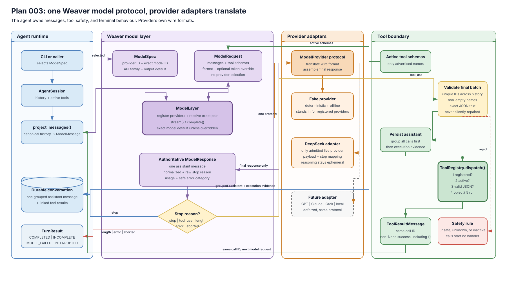

# Plan 003 Deliverables

This folder holds public, content-free evidence for Weaver's model layer,
preserved tool protocol, and active capability boundary.

## Architecture

- Editable source: [`architecture.drawio`](architecture.drawio)
- Rendered preview: [`architecture.svg`](architecture.svg)

The visual shows the provider-independent model boundary, final-response
authority, terminal outcomes, grouped tool exchange, and dispatch-time active
tool checks.

| File | Purpose | Current state |
| --- | --- | --- |
| `plan.md` | Pointer to the canonical implementation plan | Accepted 2026-07-30 |
| `learning.md` | Plain-language understanding and owner gate | Confirmed 2026-07-30 |
| `architecture.drawio` | Editable model and tool architecture | Complete |
| `architecture.svg` | Rendered architecture preview | Complete |
| `results.md` | Deterministic observations and executed commands | Complete |
| `rubric.md` | Acceptance checklist | Passed |
| `review-ledger.md` | Independent findings, repairs, and rechecks | Both rechecks passed |
| `decision.md` | Owner's final accept or reject record | Accepted 2026-07-30 |

No novel prose, chats, credentials, private receipts, or raw model reasoning
belong here.
