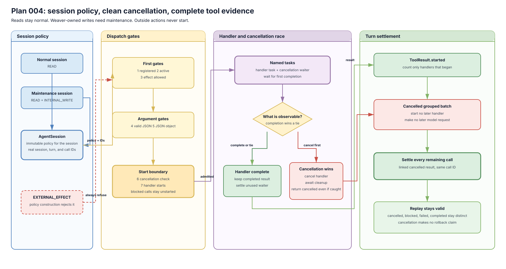

# Plan 004 Deliverables

This folder holds the public evidence for cancellation and side-effect policy.

## Architecture

- Editable source: [`architecture.drawio`](architecture.drawio)
- Rendered preview: [`architecture.svg`](architecture.svg)

The visual shows whole-session policies, ordered dispatch gates, the named
handler and cancellation race, cleanup settlement, and linked results for
every remaining call in a cancelled batch.

| File | Purpose | Current state |
| --- | --- | --- |
| `plan.md` | Pointer to the canonical implementation plan | Owner decision pending |
| `learning.md` | Plain-language understanding and owner gate | Confirmed 2026-07-30 |
| `architecture.drawio` | Editable cancellation and policy architecture | Complete |
| `architecture.svg` | Rendered architecture preview | Complete |
| `results.md` | Deterministic observations | Complete through readability pass |
| `rubric.md` | Acceptance checklist | Passed except owner decision |
| `review-ledger.md` | Independent reviews and rechecks | Both final rechecks passed |
| `decision.md` | Owner's final decision | Pending |

Do not put tool payload content, credentials, private receipts, or raw reasoning
in this folder.
