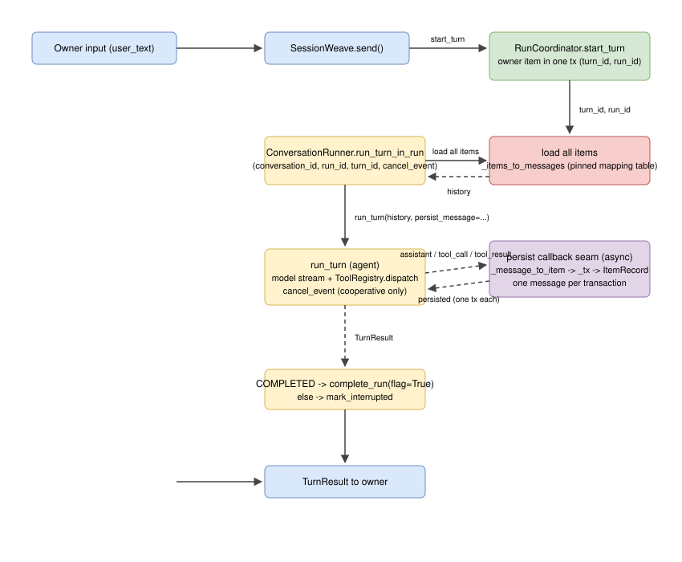

# Plan 008 Deliverables

This folder holds public, content-free evidence for wiring the conversation
loop: the first time `SessionWeave.send()` calls `run_turn()`.

## Architecture

- Editable source: [`architecture.drawio`](architecture.drawio)
- Rendered preview: [`architecture.svg`](architecture.svg)

The visual shows the ItemRecord-to-ConversationMessage adapter, the persist
callback seam, the run-turn-in-run phase lifecycle, and the SessionWeave
send() flow from owner input to TurnResult.

| File | Purpose | Current state |
| --- | --- | --- |
| `plan.md` | Pointer to the canonical implementation plan | Planned 2026-07-30 |
| `learning.md` | Plain-language understanding and owner gate | Confirmed 2026-07-31 |
| `architecture.drawio` | Editable conversation-loop architecture | Created 2026-07-31 |
| `architecture.svg` | Rendered architecture preview | Created 2026-07-31 |
| `results.md` | Deterministic observations and executed commands | Implemented 2026-07-31 |
| `rubric.md` | Acceptance checklist | Pending implementation |
| `review-ledger.md` | Independent findings, repairs, and rechecks | Pending implementation |
| `decision.md` | Owner's final accept or reject record | Pending |

## Exporter note

The draw.io desktop CLI is not available in this environment (`which drawio`
empty; `npx drawio` install failed; the global `@drawio/mcp` package is a
server, not an exporter). Per AGENTS.md fallback: the editable `.drawio`
source ships together with a hand-authored matching SVG preview; validate
the XML against app.diagrams.net when next available and re-export the SVG
from the source so they cannot drift.

No novel prose, chats, credentials, private receipts, or raw model reasoning
belong here.
