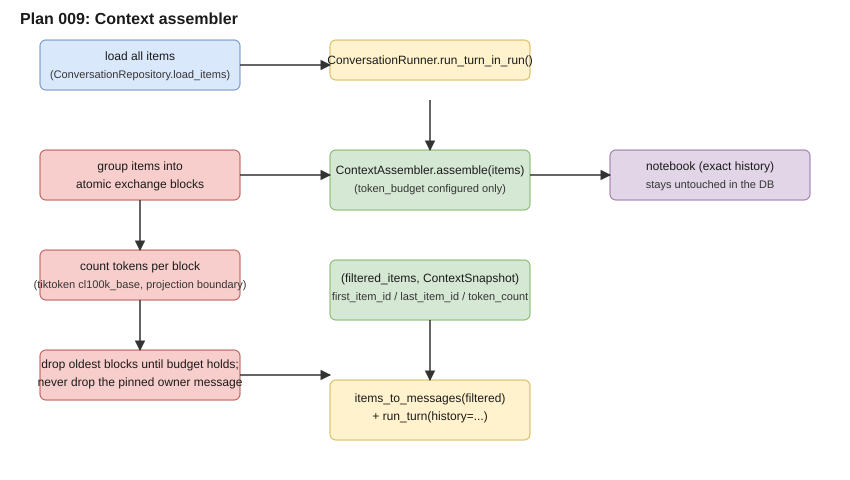

# Plan 009 Deliverables

This folder holds public, content-free evidence for the context assembler:
the first time `run_turn()` receives a token-budgeted context window.

## Architecture

- Editable source: [`architecture.drawio`](architecture.drawio)
- Rendered preview: [`architecture.svg`](architecture.svg)

The visual shows the assemble sequence: items loaded from the notebook,
token counting via tiktoken, oldest-turn-first dropping with turn-boundary
preservation, pinned owner message, and the filtered working brief entering
`run_turn()`.

| File | Purpose | Current state |
| --- | --- | --- |
| `plan.md` | Pointer to the canonical implementation plan | Planned 2026-07-30 |
| `learning.md` | Plain-language understanding and owner gate | Pending confirmation |
| `architecture.drawio` | Editable assembler architecture | Pending |
| `architecture.svg` | Rendered architecture preview | Pending |
| `results.md` | Deterministic observations and executed commands | Pending implementation |
| `rubric.md` | Acceptance checklist | Pending implementation |
| `review-ledger.md` | Independent findings, repairs, and rechecks | Pending implementation |
| `decision.md` | Owner's final accept or reject record | Pending |

No novel prose, chats, credentials, private receipts, or raw model reasoning
belong here.
