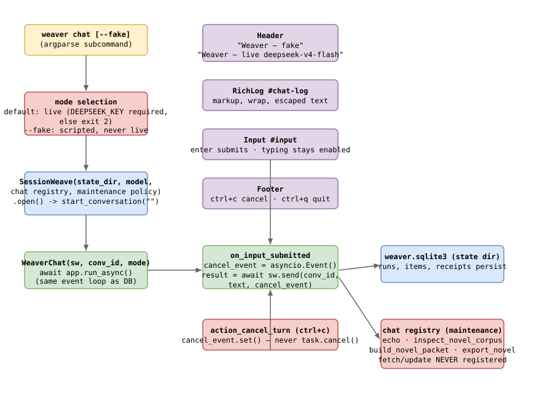

# Plan 010 Deliverables

This folder holds public, content-free evidence for the TUI entrypoint:
the first chat window the owner uses to talk to Weaver.

## Architecture

- Editable source: [`architecture.drawio`](architecture.drawio)
- Rendered preview: [`architecture.svg`](architecture.svg)

The visual shows the Textual TUI widget tree (Header, RichLog, Input), the
async event-loop integration with `SessionWeave.send()`, the fake/live mode
selection based on `DEEPSEEK_KEY`, and the tool registration boundary.

| File | Purpose | Current state |
| --- | --- | --- |
| `plan.md` | Pointer to the canonical implementation plan | Planned 2026-07-30 |
| `learning.md` | Plain-language understanding and owner gate | Confirmed 2026-07-31 |
| `architecture.drawio` | Editable TUI architecture | Built 2026-07-31 |
| `architecture.svg` | Rendered architecture preview | Built 2026-07-31 |
| `results.md` | Deterministic observations and executed commands | Implemented 2026-07-31 (3 correction rounds) |
| `rubric.md` | Acceptance checklist | Implemented 2026-07-31 |
| `review-ledger.md` | Independent findings, repairs, and rechecks | Both reviews + rechecks clean |
| `decision.md` | Owner's final accept or reject record | Pending owner decision |

No novel prose, chats, credentials, private receipts, or raw model reasoning
belong here.
