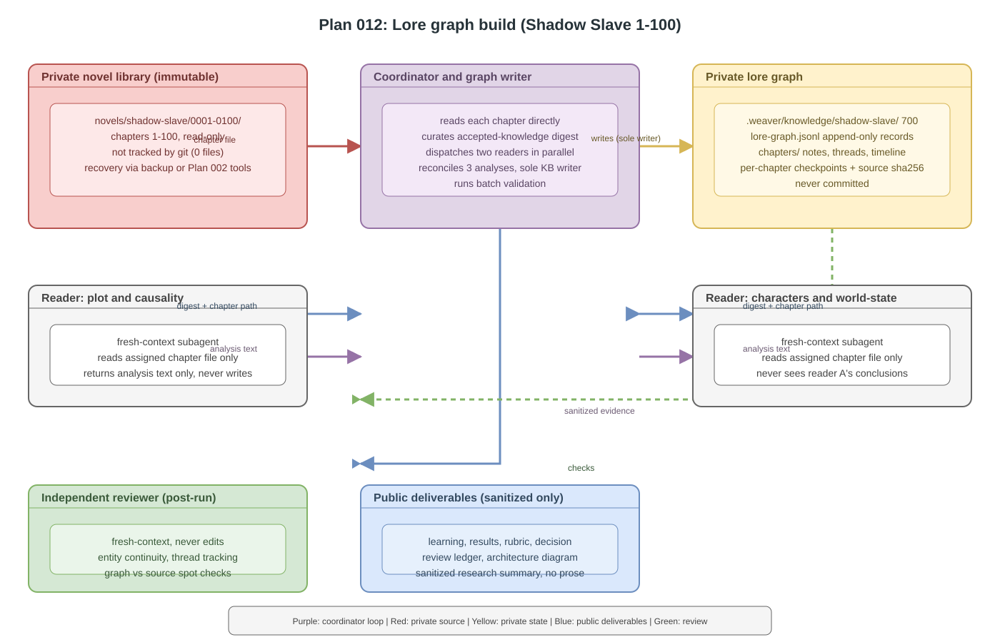

# Plan 012 Deliverables

This folder holds public, content-free evidence for the lore graph build:
the first time the agent stack reads a novel.

Plan 012 is an agent-executed reading build (owner re-scope 2026-08-03).
The chapter-1 pilot is accepted; chapters 2-100 run in restart-safe batches.
The knowledge base itself is private at `.weaver/knowledge/shadow-slave/`
and is never committed here.

## Architecture

- Editable source: [`architecture.drawio`](architecture.drawio)
- Rendered preview: [`architecture.svg`](architecture.svg)

The visual shows the reading loop: the coordinator reads each chapter from
the private novel library, dispatches two fresh-context readers (plot and
causality; characters and world-state) in parallel, reconciles all three
analyses into the private lore graph (entities, edges, threads, timeline,
checkpoints), and validates each batch. An independent reviewer checks the
finished graph. Committed deliverables carry sanitized evidence only —
never novel prose or story-derived knowledge.

| File | Purpose | Current state |
| --- | --- | --- |
| `plan.md` | Pointer to the canonical implementation plan | Active |
| `learning.md` | Plain-language understanding and owner gate | Confirmed 2026-08-03 |
| `architecture.drawio` | Editable reading-loop architecture | Done |
| `architecture.svg` | Rendered architecture preview | Done |
| `results.md` | Deterministic observations and executed commands | Pilot accepted; batches in progress |
| `rubric.md` | Acceptance checklist | Updated to lore-graph scope |
| `review-ledger.md` | Independent findings, repairs, and rechecks | Logged (Codex review 2026-08-03) |
| `decision.md` | Owner's final accept or reject record | Final pending |

No novel prose, chats, credentials, private receipts, story-derived
knowledge, or raw model reasoning belong here.
